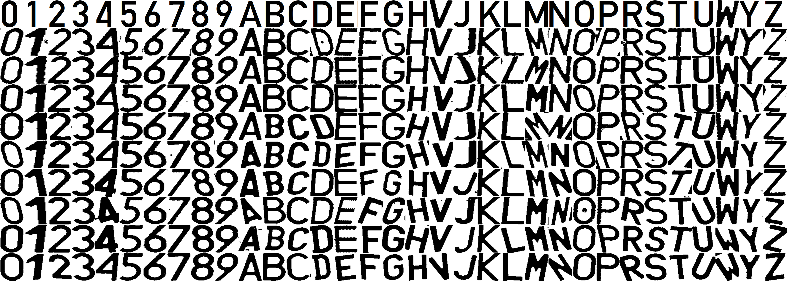

# License plate recognition
## Systemy wizyjne - laboratorium - projekt - 2023 - Miłosz Gajewski
# Struktura działania algorytmu
Algorytm został podzielony na trzy części realizujące kolejne etapy przetwarzania obrazu.
## Wyznaczenie(znalezienie) tablicy rejestracyjnej
1. Skalowanie zdjęcia do rozdzielczości 600px x 400px,
2. Konwersja zdjęcia do skali szarości,
3. Rozmywanie z wykorzystaniem filtru Gausa,
4. Zastosowanie algorytmu Canny,
5. Dylacja,
6. Znajdowanie konturów na zdjęciu,
7. Dla znalezionych konturów:
   1. Przybliżanie krzywych dla wieloboków - cv2.approxPolyDP()
   2. Wyznaczanie prostokąta dla przybliżenia - cv2.boundingRect()
   3. Wyznaczenie współczynnika proporcji dla konturu,
   4. Jeśli kontur ma cztery boki, a jego współczynnik proporcji jest powyżej 4.5 tablica została znaleziona,
8. Jeśli kontur tablicy nie został znaleziony powraca się do kroku drugiego i stosowana jest metoda:
   1. Wyliczenie filtru Sobela na zdjęciu,
   2. Zastosowanie progowania,
   3. Znajdowanie konturów na zdjęciu,
   4. Dla znalezionych konturów:
      1. Przybliżanie krzywych dla wieloboków - cv2.approxPolyDP()
      2. Jeśli kontur ma cztery boki, to tablica została znaleziona.
9. Sortowanie wierzchołków znalezionego konturu według współrzędnej x,
10. Rektyfikacja - prostowanie konturu tablicy(zdjęcie w skali szarości).
## Wyznaczenie poszczególnych liter w tablicy rejestracyjnej na uzyskanym obrazie z poprzedniego kroku
1. Zastosowanie progowania,
2. Operacja otwarcia,
3. Znajdowanie konturów na zdjęciu,
4. Dla znalezionych konturów:
   1. Wyliczenie pola powierzchni poszczególnych konturów,
   2. Jeżeli pole powierzchni jest w zadanym przedziale litera została znaleziona i wyznaczany jest dla niej prostokąt obudowujący,
5. Sortowanie znalezionych konturów według współrzędnej x (ustawienie liter w kolejności od lewej do prawej),
6. Sprawdzenie, czy wykryte kontury nie są wewnątrz siebie (przykład: dla litery O znaleziony został kontur zewnętrzny jak i wewnętrzny, który jest zbędny i można go usunąć),
7. Wycięcie poszczególnych liter.
## Klasyfikacja znalezionych liter
1. Wykonanie operacji progowania,
2. Skanowanie znalezionej litery do rozdzielczości 128px x 151px
3. Wykonanie operacji cv2.matchTemplate() z dostarczonym szablonem,
4. Klasyfikacja litery,
5. Weryfikacja i walidacja znalezionego ciągu znaków
6. Zwrócenie napisu.

# Wywołanie programu
```console
python3 Gajewski_Milosz.py /path/to/directory/train /path/to/output.txt
```
# Szablon znaków

